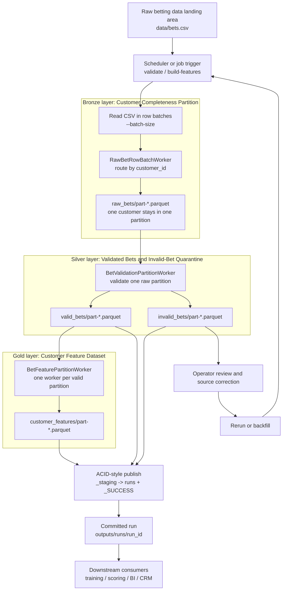
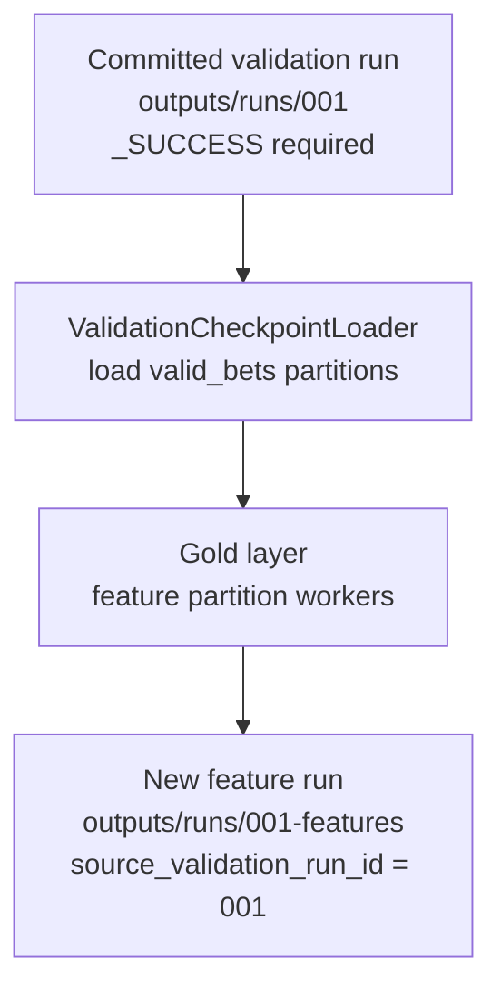

# Architecture

## Main Batch Flow

## Validation Checkpoint Reuse

## Execution Model

The pipeline has two public commands:

1. `validate` reads raw CSV in row batches, writes customer-complete raw partitions, validates each raw partition, writes valid/invalid partitions, and commits a validation run.
2. `build-features --input ...` runs the same raw partition and validation stages first, then builds customer features from the new valid-bets partitions.
3. `build-features --from-validation-run outputs/runs/<validation_run_id>` skips raw CSV validation and builds features from an already committed validation checkpoint.

The validation checkpoint path is the faster path for large inputs when validation has already completed. It requires `_SUCCESS`, records `source_validation_run_id` in the feature manifest, writes features into a new run id, and never mutates the committed validation run.

## Batch Boundaries

- Raw partition batch: `--batch-size` raw CSV rows read and routed at a time.
- Validation batch: one customer-complete `raw_bets/part-*.parquet` partition.
- Feature batch: one customer-complete `valid_bets/part-*.parquet` partition.
- `--validation-workers` can validate raw partitions concurrently.
- `--feature-workers` can process feature partitions concurrently.
- Partition routing keeps every `customer_id` in one valid-bets partition, so first-N customer features are complete.
