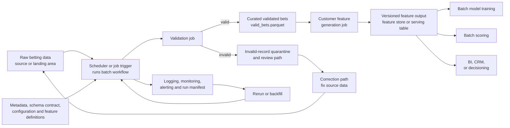

# Architecture

The local package implements the scheduled batch job. It validates raw bets, quarantines bad records, writes curated parquet, builds versioned customer features, and records enough metadata for monitoring, reruns, and downstream ML consumers.
