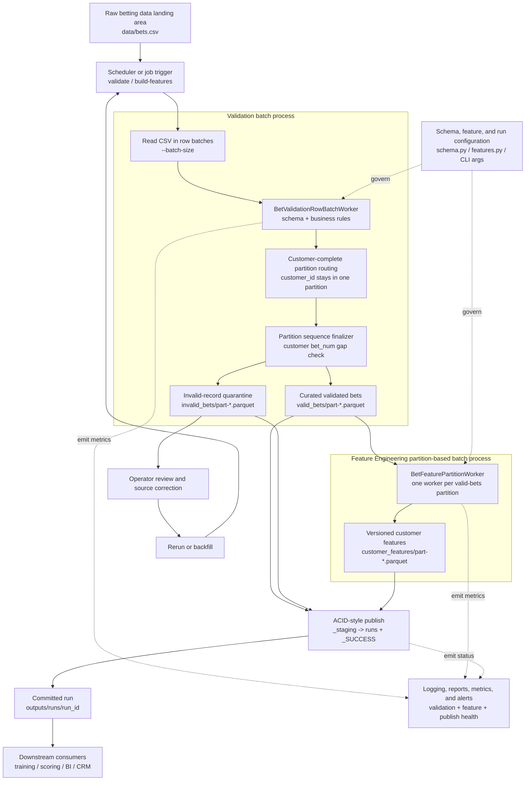
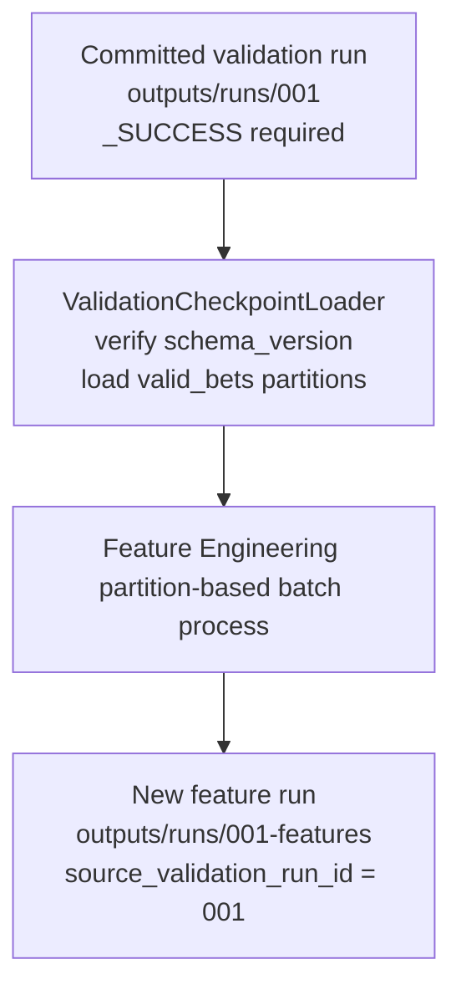

# Architecture

## Main Batch Flow

## Validation Checkpoint Reuse

## Execution Model

The pipeline has two public commands:

1. `validate` reads raw CSV, validates row batches, writes customer-complete validation partitions, and commits a validation run.
2. `build-features --input ...` runs validation first, then builds customer features from the new valid-bets partitions.
3. `build-features --from-validation-run outputs/runs/<validation_run_id>` skips raw CSV validation and builds features from an already committed validation checkpoint.

The validation checkpoint path is the faster path for large inputs when validation has already completed. It requires `_SUCCESS`, checks that the validation `schema_version` matches the current code, records `source_validation_run_id` in the feature manifest, writes features into a new run id, and never mutates the committed validation run.

## Batch Boundaries

- Validation batch: `--batch-size` raw CSV rows read and validated at a time.
- Feature batch: one customer-complete `valid_bets/part-*.parquet` partition.
- `--validation-workers` can validate row batches concurrently.
- `--feature-workers` can process feature partitions concurrently.
- Partition routing keeps every `customer_id` in one valid-bets partition, so first-N customer features are complete.

## Production Controls

These controls are intentionally kept out of the main diagram so the data flow stays readable:

- Schema contracts live in `schema.py` and are versioned through `SCHEMA_VERSION`.
- Feature definitions live in `features.py` and are versioned through `FEATURE_SET_VERSION`.
- JSON reports and run manifests record row counts, failure counts, feature counts, schema version, feature version, output paths, and checkpoint lineage.
- Monitoring should alert on failed runs, missing `_SUCCESS`, invalid-rate spikes, empty feature output, missing partition files, or schema/version mismatches.
- Downstream systems should read only committed `outputs/runs/<run_id>/` paths with `_SUCCESS`.
