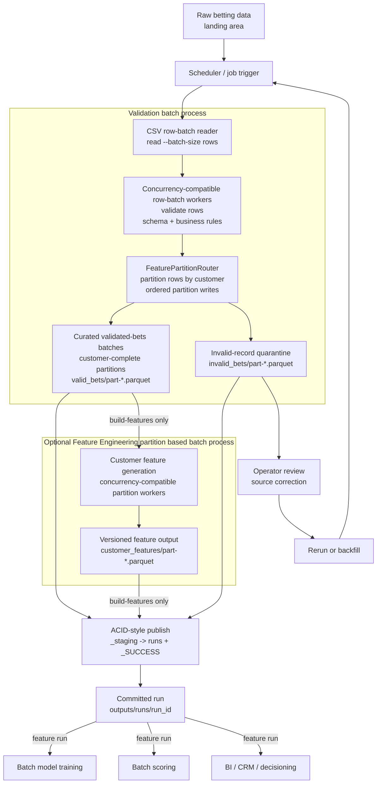

# Architecture

## Pipeline Diagram

## Execution Model

Both public commands run a staged batch workflow:

1. `bet_pipeline.main` creates a staged run through `RunArtifactPublisher`.
2. `BetValidationBatchProcess` reads the bounded raw CSV in row batches with `--batch-size`.
3. For each row batch, a validation row-batch worker validates rows against schema and business rules.
4. Local execution defaults to one validation worker. `--validation-workers` can be increased to validate row batches concurrently.
5. `FeaturePartitionRouter` receives validated row-batch results in source order, keeps every `customer_id` in one feature partition, and writes customer-complete `valid_bets/part-*.parquet` batches.
6. If the command is `validate`, the run stops after validation artifacts are written and committed.
7. If the command is `build-features`, `BetFeatureBatchProcess` runs the optional feature engineering partition based batch process. It reads `valid_bets/part-*.parquet`; each valid part is one customer-complete feature batch handled by a partition worker.
8. Local execution defaults to one feature worker. `--feature-workers` can be increased to process feature partitions concurrently. Each worker writes one distinct `customer_features/part-*.parquet` file.
9. `RunArtifactPublisher` checks required artifacts, writes `_SUCCESS`, and publishes `outputs/runs/<run_id>`.

## Partitioning

There is no full-file row-count pass before validation.

`--target-feature-partition-rows` defaults to `DEFAULT_BATCH_ROWS = 1000`. If `--feature-partition-count` is not supplied, new customers are assigned to dynamic feature partitions until the current partition reaches that target. Existing customers always stay in their original partition.

If `--feature-partition-count` is supplied, routing uses deterministic `hash(customer_id) % N`.

## Guarantees

- Row batches control validation memory usage; they are not feature boundaries.
- `valid_bets/part-*.parquet` is the batch-processing boundary for feature generation.
- Feature partitions are customer-complete, so first-N customer features are not split across row batches.
- The validation design is concurrency-compatible because partition routing and parquet writes are coordinated in source-row-batch order.
- The feature design is concurrency-compatible because each feature worker owns one output partition file.
- Invalid records are quarantined and excluded from feature generation.
- Downstream systems should consume only committed `outputs/runs/<run_id>/` directories with `_SUCCESS`.
- Local ACID behavior is provided by staging first, checking required artifacts, then publishing the run directory.
- Schema contracts, feature definitions, run manifests, reports, metrics, and alerts still exist in the system; they are kept out of the diagram to keep the data flow readable.
