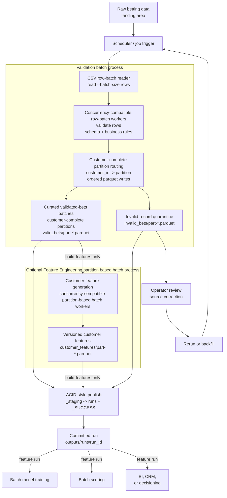

# Design Note

## Summary

This pipeline builds a production-style batch dataset for downstream ML consumers from raw betting records. The public `validate` command writes committed validation artifacts only. The public `build-features` command validates first, then optionally enters feature engineering to build customer-level features from the validated partitions.

The important design choice is separating validation row batches from feature batches:

- **Validation row batch:** `--batch-size` raw CSV rows read and validated at a time.
- **Feature batch:** one customer-complete `valid_bets/part-*.parquet` file.

This avoids loading the full raw CSV into memory while preserving customer completeness for first-N feature generation.

## Architecture Diagram

## Components

| Component | Responsibility | Data in | Data out |
| --- | --- | --- | --- |
| Raw betting landing area | Holds the immutable source extract for a run. | Raw CSV such as `data/bets.csv` | CSV rows for validation |
| Scheduler / job trigger | Starts either `validate` or `build-features` with input, output, run id, and sizing arguments. | Schedule, manual request, rerun, or backfill request | CLI invocation |
| Validation batch process | Owns the validation stage over a bounded source file. | Raw CSV file | Curated valid-bets and invalid-record partitions |
| CSV row-batch reader | Reads the bounded source file in `--batch-size` row batches without loading the whole file into memory. | Raw CSV file | Row batches |
| Concurrency-compatible row-batch workers | Validate row batches against schema and business rules. Local execution defaults to one worker, but the design can run multiple workers. | One row batch per worker | Valid rows, invalid rows, validation metrics |
| Customer-complete partition routing | Assigns rows to customer-complete partitions and coordinates ordered parquet writes. | Valid and invalid validation results | Partitioned valid and invalid parquet rows |
| Curated validated-bets batches | Trusted handoff from validation to feature engineering. | Valid rows | `validation/valid_bets/part-*.parquet` |
| Invalid-record quarantine | Stores rejected rows for investigation and correction. | Invalid rows plus validation errors | `validation/invalid_bets/part-*.parquet` |
| Optional Feature Engineering partition based batch process | Runs only for `build-features`; owns customer feature generation from valid-bets partitions. | `validation/valid_bets/part-*.parquet` | Customer feature partitions |
| Customer feature generation | Runs partition-based batch workers over customer-complete valid-bets parts. Local execution defaults to one worker, but the design can run multiple workers. | One valid-bets partition per worker | Feature rows |
| Versioned customer features | ML-facing customer-level feature dataset. | Feature rows | `features/customer_features/part-*.parquet` |
| ACID-style publish | Checks required artifacts, writes `_SUCCESS`, and publishes the staged run. | Staged validation and optional feature artifacts | Committed run directory |
| Committed run | Stable output location that downstream systems can safely read. | Published artifacts | `outputs/runs/<run_id>/` |
| Operator review / source correction | Investigates quarantined rows and coordinates upstream fixes. | Invalid-record quarantine | Corrected source data or review outcome |
| Rerun or backfill | Reprocesses corrected or historical source snapshots through the same workflow. | Correction or backfill request | New committed run |
| Batch model training | Consumes committed feature runs for offline model training. | `customer_features/part-*.parquet` | Training dataset |
| Batch scoring | Consumes committed feature runs for offline scoring. | `customer_features/part-*.parquet` | Scored customers |
| BI / CRM / decisioning | Consumes committed feature runs for analytics or activation. | `customer_features/part-*.parquet` | Analytical, CRM, or operational outputs |

## Data Flow

`bet_pipeline.main` receives either `validate` or `build-features`. Both commands run validation and commit validation artifacts. Only `build-features` enters the optional feature engineering partition based batch process.

Validation reads row batches from the bounded source file. The batch size defaults to `DEFAULT_BATCH_ROWS = 1000`. Each row batch is validated by `BetValidationRowBatchWorker`. Local execution defaults to one validation worker; `--validation-workers` can be increased when concurrent row-batch validation is wanted. The pipeline does not perform a separate full-file row-count pass before validation.

Rows are routed by customer-complete partition routing:

- If `--feature-partition-count` is set, customer routing is deterministic hash modulo the supplied count.
- If `--feature-partition-count` is not set, `--target-feature-partition-rows` controls dynamic partition creation. It defaults to `DEFAULT_BATCH_ROWS`. New customers are assigned to the current partition until that partition reaches the target. Existing customers always stay in their original partition.

Valid rows are written to `validation/valid_bets/part-*.parquet`. Invalid rows are written to `validation/invalid_bets/part-*.parquet`. Feature generation reads only the valid-bets partitions.

Partition routing and parquet writes are coordinated in source-row-batch order. That keeps output deterministic even when validation uses multiple workers.

Feature engineering is a partition based batch process. Local execution defaults to one feature worker; `--feature-workers` can be increased when concurrent partition processing is wanted. Each `BetFeaturePartitionWorker` is a partition-based batch worker: it reads one customer-complete valid-bets part and writes the matching `customer_features/part-*.parquet` file, so feature workers do not share writers.

## Concurrency Support

The pipeline supports concurrency in two separate places:

- **Validation concurrency:** local execution defaults to one worker. `--validation-workers` controls how many raw CSV row batches can be validated at the same time when concurrency is enabled. The validation workers only validate rows. Customer-complete partition routing assigns each customer to one partition and coordinates parquet writes in source-row-batch order, so concurrent validation does not change output determinism.
- **Feature concurrency:** local execution defaults to one worker. `--feature-workers` controls how many customer-complete valid-bets partitions can be processed at the same time when concurrency is enabled. Each feature worker reads one `valid_bets/part-*.parquet` file and writes one matching `customer_features/part-*.parquet` file, so feature workers do not share output writers.

Concurrency improves throughput without changing the logical batch boundaries. Validation row batches are memory boundaries. Feature partitions are customer-completeness boundaries.

## Why Batch

The required output is a reproducible customer-level dataset derived from historical first-N betting records. Batch processing is a good fit because training, batch scoring, BI, and CRM workflows need a stable feature snapshot with lineage.

Streaming would be useful for live risk decisions or real-time activation, but it would require stateful per-customer feature storage, late-arrival handling, and online/offline feature consistency controls. For this task, batch keeps the system easier to audit and rerun.

## Customer Completeness

Feature generation must use each customer's first N bets by authoritative `bet_num`. A customer can appear in many validation row batches, so row batches cannot be feature boundaries.

The feature partition is the customer-completeness boundary. Every row for the same `customer_id` is routed to the same partition. That means `BetFeaturePartitionWorker` can build customer features from one valid-bets part without needing records from another part.

`--target-feature-partition-rows` is approximate. The pipeline will not split a customer to hit that target. If one customer has many rows, that partition can exceed the target. Customer completeness is more important than equal file size.

Concurrent feature generation, when enabled, does not change feature semantics. It only changes how many customer-complete partitions are processed at once.

## Validation And Schema Safety

Validation enforces the row-level business rules:

- `betting_amount > 0`
- `price > 1`
- `category` is `sports` or `racing`
- `stake_type` is `cash` or `bonus`
- `bet_result` is `return` or `no-return`
- payout formula by `bet_result` and `stake_type`
- `return_for_entain` formula by `bet_result` and `stake_type`
- parseable identifiers, timestamps, and numeric values

The batch writes parquet using explicit Arrow schemas. Reports include schema and feature-set versions. Breaking changes should create a new schema or feature-set version rather than changing existing semantics in place.

The local row-batch validation pass does not do a global full-file precheck for cross-row constraints. In a larger production system, constraints such as global `bet_id` uniqueness or full customer bet-number sequence checks should be handled by a distributed validation stage or table-level quality check before publishing.

## Invalid Records

Invalid rows are isolated under `validation/invalid_bets/`. They are not used for feature generation and are not silently discarded.

Each invalid row includes original values, source row number, validation errors, and validation timestamp. Operators can inspect `validation_report.json`, identify failure counts by rule, correct upstream data, and rerun the batch.

If invalid records appear inside a customer's first-N window, behavior is deterministic:

1. Invalid rows are quarantined.
2. Feature generation uses only valid rows where `bet_num <= first_n_bets`.
3. Later valid bets are not pulled forward to fill gaps.
4. `bets_used` can be less than `first_n_bets`.
5. `nth_bet_datetime` is present only when the valid `bet_num == first_n_bets` row exists.
6. `customers_with_incomplete_first_n` is reported.

## Feature Definitions And Consumers

Feature definitions live in `BetFeatureBuilder` and are reported through `feature_set_version`, `feature_columns`, and `first_n_bets`. Consumers should rely on the parquet schema and feature report, not only file names.

The customer-level feature row is intentionally compact and auditable. It uses the first-N validated bets by authoritative `bet_num` and produces:

| Feature group | Fields | Reason |
| --- | --- | --- |
| Window lineage | `first_bet_datetime`, `nth_bet_datetime`, `bets_used`, `feature_generated_at` | Tells consumers what early window was observed, whether the full window was available, and when the feature row was produced. |
| Stake behavior | `total_betting_amount`, `mean_betting_amount` | Captures both total early stake volume and typical stake size. |
| Price behavior | `mean_price` | Summarizes early odds profile, which can proxy for risk preference or bet style. |
| Product and funding mix | `pct_racing`, `pct_cash` | Converts categorical behavior into numeric model features for product preference and cash-versus-bonus usage. |
| Outcome and value | `pct_return`, `total_payout`, `total_return_for_entain` | Captures early return frequency, customer payout experience, and value to Entain. |

Sums are used where total exposure matters. Means are used where typical behavior should be comparable across customers with different valid-row counts. Percentages are used for categorical fields so downstream models and scoring jobs receive stable numeric inputs.

Downstream systems should read only committed runs that contain `_SUCCESS`:

- Batch training records `run_id`, schema version, and feature-set version with the model.
- Batch scoring checks the expected feature-set version before scoring.
- BI, CRM, and decisioning systems consume the committed feature dataset or a promoted serving table built from it.

## Reruns, Backfills, And ACID

Runs write to `outputs/_staging/<run_id>/` first. Consumers should never read staging paths. After validation, optional feature generation, reports, and manifest are present, `RunArtifactPublisher` checks required artifacts, writes `_SUCCESS`, and publishes to `outputs/runs/<run_id>/`.

The ACID-style setup applies to both commands:

- `validate` commits validation artifacts only.
- `build-features` commits validation artifacts plus feature artifacts.

For the local filesystem implementation:

- **Atomicity:** failed runs are removed from staging; successful runs publish only after required artifacts exist.
- **Consistency:** schemas, reports, manifest, and partition files are checked before commit.
- **Isolation:** consumers read only committed run directories.
- **Durability:** after the filesystem rename succeeds, committed artifacts remain under `runs/<run_id>/`.

Object stores usually do not provide atomic directory rename. A production cloud implementation should use immutable part files plus a transaction manifest, or a table format such as Iceberg, Delta, or Hudi.

Backfills and corrections should create new immutable runs. Reusing a run id should be reserved for controlled reruns where the old staged or committed path has been intentionally removed.

## Test Strategy

The repository includes three levels of automated checks:

- **Lint and formatting:** `.github/scripts/run_lint.sh` runs Ruff formatting checks and lint rules against `src` and `tests`.
- **Unit tests:** `.github/scripts/run_tests.sh` runs `unittest` discovery against `tests/unit/`. These tests cover validation rules, payout and return formulas, customer-complete partitioning, first-N feature behavior, invalid first-N handling, CLI orchestration, validation worker compatibility, and feature worker compatibility.
- **E2E integration test:** `tests/integrate/test_docker_pipeline.py` is a pytest test that builds the Docker image, runs `bet-pipeline build-features` end to end against the small fixture at `tests/integrate/fixtures/bets.csv`, and verifies committed run artifacts such as `_SUCCESS`, `run_manifest.json`, validation reports, feature reports, and parquet partition outputs. It also checks the ACID-style publish contract, invalid-record quarantine content, valid parquet rows, customer-complete partitioning, and customer feature values.

GitHub Actions runs these checks on push. The `Tests` workflow has separate `unit-tests` and `e2e-integration-tests` jobs. The unit test job uploads `unit-test-outputs`, which contains the verbose unittest log. The E2E job uploads `integration-test-outputs`, which contains the pytest log and JUnit XML, and also uploads the generated `integration_outputs/` directory as `docker-integration-outputs` so reviewers can inspect the committed batch outputs from the workflow run. The `Lint` workflow uploads `lint-outputs`, which contains the Ruff format-check and lint logs.

## Monitoring And Alerts

Production monitoring should capture:

- total rows, valid rows, invalid rows, and invalid-rate percentage
- failure counts by validation rule
- validation batch count and batch size
- feature partition count and output part count
- customer feature row count
- customers with incomplete first-N windows
- runtime by validation, feature, and publish stage
- missing part files or missing `_SUCCESS`
- schema version and feature-set version

Alerts should fire on missing required columns, invalid-rate spikes, empty feature output, missing partition files, failed publish, unexpected schema or feature version, or consumers attempting to read uncommitted paths.

## Trade-Offs

The implementation is intentionally local and vendor-neutral. It uses parquet for typed, compressed batch outputs and JSON for small operational reports.

The dynamic target-row partitioning avoids a full-file count pass, but partition count depends on source order and customer skew. If a production run needs stable partition numbering across reruns, use `--feature-partition-count`.

Feature generation currently reads one valid-bets partition into a worker. That is acceptable when partitions are sized correctly. For very large or skewed customers, production should either increase worker resources, tune partition settings, or use a distributed engine that can keep per-customer state safely.
