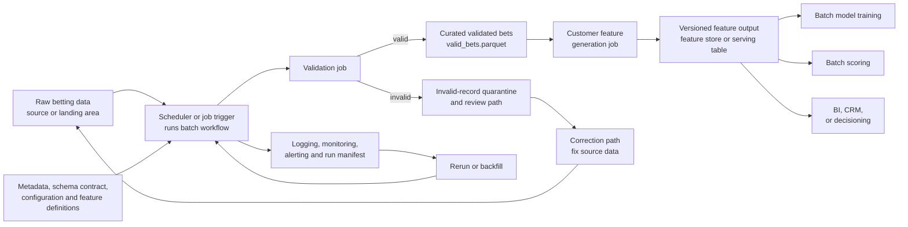

# Design Note

## Architecture Diagram

## Component Responsibilities

| Component | Why it exists and what it owns | Data in | Data out |
| --- | --- | --- | --- |
| Raw betting source or landing area | Holds the immutable input snapshot for a batch run. The pipeline treats it as untrusted. | Source extract, locally `data/bets.csv` | Raw rows passed to the batch job |
| Scheduler or job trigger | Starts the batch with a stable input path, output path, and `run_id`. Locally this is `bet-pipeline build-features`. | Schedule/backfill request and run configuration | One validation-and-feature batch run |
| Metadata, schema contract, and configuration | Governs column names, allowed domains, schema version, feature-set version, and feature definitions. | Code/configuration in `schema.py` and feature builder settings | Contracts used by validation, feature generation, and consumers |
| Validation job | Enforces required columns, types, domains, payout formulas, Entain return formulas, IDs, timestamps, and bet ordering. | Raw betting rows | `valid_bets.parquet`, `invalid_bets.parquet`, `validation_report.json` |
| Invalid-record quarantine and review path | Keeps bad records out of features while preserving enough context for investigation. | Invalid raw rows and validation errors | Quarantined rows with source row number, errors, and validation timestamp |
| Curated validated-bets layer | Provides the trusted contract between validation and feature generation. | Valid rows from validation | Typed parquet records in `valid_bets.parquet` |
| Customer feature generation job | Builds deterministic customer-level features from curated bets. | `valid_bets.parquet` | `customer_features.parquet` and `feature_report.json` |
| Versioned feature output or serving table | Provides the ML-facing feature interface. | Customer feature rows and feature metadata | Versioned feature table for training, scoring, analytics, CRM, or decisioning |
| Logging, monitoring, alerting, and manifest | Gives operators lineage, quality signals, and failure visibility. | Run metadata, validation counts, feature counts, output paths | `run_manifest.json`, metrics, logs, and alerts |
| Rerun, backfill, and correction path | Reprocesses corrected source data or historical partitions using the same contracts. | Corrected source snapshot or backfill request | New validated outputs, feature outputs, and manifest |

## Data Entering And Leaving Each Step

The raw landing area receives a source extract with one row per bet. The scheduler passes that source path into the batch run.

Validation receives raw CSV rows and emits three artifacts: `valid_bets.parquet`, `invalid_bets.parquet`, and `validation_report.json`. Valid bets contain typed, business-rule-compliant records. Invalid bets preserve raw values and failure reasons. The report summarizes row counts, failure counts, schema version, run id, and input fingerprint.

Feature generation receives `valid_bets.parquet` and emits `customer_features.parquet` plus `feature_report.json`. The feature table has one row per customer with first-20-bet aggregates. The report records feature-set version, run id, input fingerprint, output format, and customer count.

The run manifest receives metadata from the orchestrator, validation job, and feature job. It emits `run_manifest.json`, which is the top-level lineage artifact for the batch.

## Why Batch Processing

Batch processing is the right fit here because the requested dataset is derived from historical first-20-bet windows. The output is customer-level and reproducible for a fixed input snapshot. Batch also gives simple auditability: the same input, code version, schema version, feature version, and run id should produce the same logical output.

Streaming could fit if the business needed near-real-time risk decisions, live CRM triggers, or operational interventions immediately after each bet. Even then, the streaming path should use the same feature definitions and schema contracts as the batch path. For this exercise, streaming would add state management and late-arrival handling without improving the requested ML training or batch scoring dataset.

## Schema Validation, Versioning, And Downstream Safety

Schemas are enforced before feature generation. Required columns, domains, numeric rules, formulas, and ordering assumptions are validated by `BetValidator`. Validated data and feature data are written as parquet with explicit Arrow schemas.

The current schema version is `bets-v1`; the current feature-set version is `customer-first-20-v1`. Reports and manifests include these versions so downstream consumers can detect incompatible changes. Breaking changes should create a new schema or feature-set version rather than silently changing existing columns or semantics.

Downstream consumers rely on the parquet schema, feature-set version, and run manifest. A production promotion process should compare schema versions and feature definitions before allowing a new feature table to replace or feed production consumers. Backward-compatible changes can add new optional features; breaking changes should use a new feature-set version and a separate serving table or partition.

## Invalid Records And Operator Workflow

Invalid rows are isolated in `invalid_bets.parquet`; they are not silently dropped. Each invalid row contains enough context for investigation: original values, source row number, validation errors, and validation timestamp.

Operators should monitor failure counts by rule. A small stable number of invalid rows might be acceptable for a synthetic or noisy feed, but spikes in rules such as `missing_column`, `category_domain`, `payout_formula`, or `customer_bet_num_sequence` should trigger investigation. After upstream correction, the raw source snapshot can be regenerated and the batch can be rerun with a new or deliberately reused run id.

## Feature Definition Consistency

Feature definitions live in code and are covered by tests. The feature builder uses one deterministic policy: validate first, exclude invalid rows, then aggregate valid bets where `bet_num <= 20`.

If invalid records appear in a customer's first 20 raw bets, the pipeline handles the case explicitly. The invalid rows go to quarantine with validation errors. Feature generation still creates a customer feature row from the remaining valid first-20 records. Later valid bets are not pulled forward to fill the gap, because doing that would change the meaning of "first 20 bets" depending on data quality. The feature row exposes the result through `bets_used`, which can be less than 20. `twentieth_bet_datetime` is only populated if the valid `bet_num == 20` row exists. The feature report and run manifest include `customers_with_incomplete_first_20` so operators and downstream consumers can see how many customer windows were affected.

Consistency across producers and consumers comes from the feature-set version, parquet schema, tests, and manifest. Consumers should depend on named columns and the feature-set version rather than inferring semantics from file names alone. In production, feature definitions should be reviewed with code changes and promoted with the same release process as model training and scoring code.

## Downstream Consumption

Batch model training can read `customer_features.parquet` or a promoted feature-store partition for reproducible training datasets. It should record the pipeline `run_id`, feature-set version, and input fingerprint with the trained model.

Batch scoring can read the same feature table to generate customer-level predictions for a scoring date or source snapshot. The scoring job should validate that the expected feature-set version is present before scoring.

BI, analytics, CRM activation, or operational decisioning systems can also consume the feature table. They rely on the parquet schema, stable customer grain, feature-set version, and manifest metadata to understand freshness and lineage.

## Reruns, Idempotency, And Backfills

The batch is idempotent for the same input snapshot, run id, code version, and output path. Writes are atomic: files are written to temporary paths and then moved into place. This reduces the risk of downstream consumers seeing partial files.

For backfills, callers should provide a stable `--run-id` and write into a partitioned output location such as `outputs/source_date=YYYY-MM-DD/run_id=.../`. A correction path should preserve the old manifest and generate a new manifest for the corrected run, so model and analytics users can trace which output they consumed.

If source data changes, the input fingerprint in the manifest will change. That fingerprint allows operators and consumers to distinguish a true rerun from a changed-source correction.

## Monitoring And Alerts

At minimum, production monitoring should capture total input rows, valid rows, invalid rows, invalid-rate percentage, failure counts by rule, customer feature rows, runtime, output file sizes, schema version, feature-set version, and run status.

Alerts should fire when required columns are missing, invalid-row rate exceeds an expected threshold, no feature rows are produced, customer counts move unexpectedly, feature output is missing, or a downstream consumer sees an unexpected schema or feature-set version.

## Trade-Offs And Assumptions

The implementation is local and vendor-neutral. It uses parquet for production-style batch outputs because parquet preserves types, compresses well, and is efficient for ML and analytics scans. JSON is used for reports and manifests because those artifacts are small and machine-readable.

The pipeline excludes invalid records before feature generation. This protects downstream ML consumers from corrupted inputs, but it means some customers can have fewer than 20 valid bets. That behavior is explicit through `bets_used` and documented in the feature policy.

The current implementation reads the input into memory, which is acceptable for the supplied dataset and keeps the code simple. At larger scale, the same design should be implemented with chunked processing or a distributed batch engine while preserving the same contracts, run manifest, validation rules, and feature definitions.
